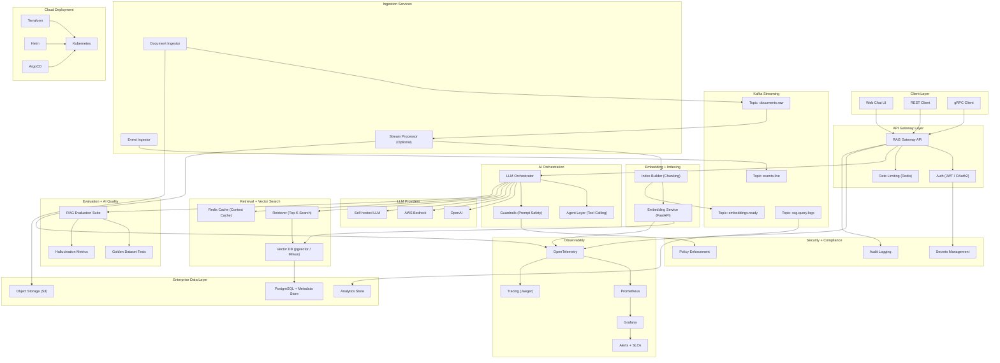

# Real-Time AI Copilot Platform (Kafka + RAG + Vector Search + LLM)

## Author

**Adalberto de Oliveira Santos**  
Staff Backend Engineer → AI Platform Engineer  
Building distributed systems at scale

- LinkedIn: https://linkedin.com/in/adalbertosantos
- GitHub: https://github.com/AdeOSantos


Production-grade **AI Engineering** showcasing how modern companies build and deploy **LLM-powered systems** with:

- **Real-time streaming ingestion (Kafka)**
- **Retrieval-Augmented Generation (RAG)**
- **Vector databases (pgvector / Milvus)**
- **LLM orchestration (LangChain / LlamaIndex)**
- **AI evaluation pipelines**
- **Kubernetes + Terraform deployment**
- **Full observability (OpenTelemetry, Grafana, Prometheus)**

This project is designed to demonstrate **AI Platform Engineering** skills.

---

## Project Goal

Build an **Enterprise AI Copilot** that can answer questions over continuously updating company knowledge.

Unlike toy chatbots, this system is:

-  Real-time  
-  Streaming-first  
-  RAG with citations  
-  Production-ready  
-  Cloud-native  
-  Observable + measurable  
-  Built like a real AI platform team would do

---

## What This Platform Does

This AI Copilot can:

- Ingest documents (PDFs, Markdown, Web pages)
- Consume live business events via Kafka
- Generate embeddings and store them in a vector DB
- Answer user questions using RAG + LLM
- Return **answers with sources**
- Continuously update knowledge in real time
- Run evaluation benchmarks automatically
- Deploy on Kubernetes with full monitoring

---


## High-Level Architecture





---

## Key Features

### Retrieval-Augmented Generation (RAG)
- Semantic retrieval over enterprise knowledge
- Top-k context injection into LLM prompt
- Answers always include citations

### Real-Time Knowledge Updates
- Kafka streams continuously update embeddings
- No manual re-indexing

### AI Evaluation Harness
- Automated RAG scoring (RAGAS)
- Golden dataset regression tests
- Hallucination + faithfulness metrics

### Production-Grade Engineering
- Rate limiting + caching
- Observability + tracing
- Multi-tenant design ready
- Token cost controls

### Cloud-Native Deployment
- Docker Compose for local dev
- Kubernetes + Helm for production
- Terraform infrastructure templates

---

## Tech Stack

### AI / GenAI Layer
- LangChain / LlamaIndex
- OpenAI API / Anthropic / AWS Bedrock
- Prompt Guardrails + Tool Calling Agents

### Embeddings + Vector Search
- SentenceTransformers
- pgvector (PostgreSQL)
- Milvus (optional)

### Streaming + Data Platform
- Apache Kafka
- Schema Registry + Avro
- Spark/Flink extensions (optional)

### Backend + APIs
- Go (Fiber / Gin)
- Java 21 + Spring Boot 3
- gRPC + REST

### Infra & Platform
- Kubernetes (EKS-ready)
- Terraform + Helm + ArgoCD
- GitHub Actions CI/CD

### Observability
- OpenTelemetry
- Prometheus + Grafana
- Jaeger + Datadog-ready

---

## Repository Structure

ai-rag-streaming-platform/
│
├── services/
│   ├── ingestion-go/          # Document + event ingestion
│   ├── embedding-python/      # Embedding + vector indexing
│   ├── rag-api-java/          # Main AI Copilot API gateway
│   ├── agent-service/         # Tool-using AI agent layer
│
├── infra/
│   ├── docker-compose/        # Local environment
│   ├── terraform/             # Cloud infrastructure
│   ├── helm/                  # Kubernetes deployment charts
│
├── eval/
│   ├── golden-dataset/        # Benchmark QA pairs
│   ├── ragas-benchmarks/      # Evaluation scripts
│
├── docs/
│   ├── architecture.md
│   ├── latency-results.md
│   ├── roadmap.md
│
└── README.md


---

## Quickstart (Local)

### 1. Clone Repository
```bash
git clone https://github.com/ADeOSantos/ai-rag-kafka-streaming-platform.git
cd ai-rag-kafka-streaming-platform
```

### 2. Start Infrastructure

Run Kafka + Postgres + Vector DB + Redis:

```bash
docker-compose up -d
```

### 3. Run Embedding Service

```bash
cd services/embedding-python
pip install -r requirements.txt
uvicorn main:app --reload
```

### 4. Run RAG Gateway API

```bash
cd services/rag-api-java
./mvnw spring-boot:run
```

### 5. Ask Questions

Example query:

```bash
curl -X POST http://localhost:8080/query \
  -d '{"question":"What systems process 10M events/day?"}'
```

```json
{
  "answer": "The global IoT platform processes over 10M events/day...",
  "sources": [
    "buckman_architecture.pdf",
    "event_pipeline.md"
  ]
}
```

---

## Kafka Topics

| Topic Name | Purpose |
|-----------|---------|
| documents.raw | Raw docs ingestion |
| embeddings.ready | Embedding pipeline output |
| events.live | Real-time enterprise events |
| rag.query.logs | Copilot usage analytics |

---

## Evaluation & Benchmarking

Run RAG evaluation suite:

```bash
cd eval/ragas-benchmarks
python run_eval.py
```

Metrics tracked:
- Faithfulness
- Context precision
- Answer relevance
- Hallucination rate

Example output:

```
RAG Score: 0.87
Hallucination Rate: 2.1%
p95 Latency: 220ms
```

---

## Performance Targets

| Metric | Goal |
|--------|------|
| p95 latency | < 300ms |
| p99 latency | < 500ms |
| Kafka throughput | 50k+ msg/sec |
| Hallucination rate | < 3% |

---

## Safety & Guardrails

Implemented protections against:
- Prompt injection
- Data leakage
- Unsafe completions
- Over-budget token usage

Includes:
- Input sanitization
- Output validation
- Policy filters

---

## Deployment (Kubernetes)

### Deploy with Helm

```bash
helm upgrade --install ai-copilot infra/helm
```

### Deploy with Terraform

```bash
cd infra/terraform
terraform init
terraform apply
```

Supports:
- AWS EKS + Bedrock
- GCP Vertex AI
- Azure AI Studio

---

## Roadmap

Planned upgrades:
- Multi-modal RAG (images + docs)
- LoRA fine-tuning pipeline
- Triton inference serving
- Online feedback learning loop
- Full AI observability dashboards

---


